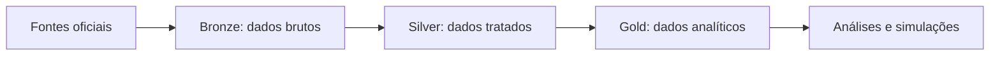

# MVP — Poupança Previdenciária Complementar

## Projeção da taxa de reposição de renda com enfoque na Região Sudeste

**Aluna:** Lidiane Nunes da Silva Celestino  
**Curso:** Ciências de Dados e Analytics  
**Instituição:** PUC-Rio  
**Plataforma:** Databricks Free Edition  
**Status:** Pipeline Bronze–Silver–Gold concluído; análises e documentação final em andamento

---

## Sumário

1. [Introdução](#1-introdução)
2. [Descrição do problema](#2-descrição-do-problema)
3. [Objetivos](#3-objetivos)
4. [Perguntas de negócio](#4-perguntas-de-negócio)
5. [Escopo do projeto](#5-escopo-do-projeto)
6. [Fontes e coleta dos dados](#6-fontes-e-coleta-dos-dados)
7. [Arquitetura do pipeline](#7-arquitetura-do-pipeline)
8. [Modelagem dos dados](#8-modelagem-dos-dados)
9. [Processo de carga e transformação](#9-processo-de-carga-e-transformação)
10. [Qualidade dos dados](#10-qualidade-dos-dados)
11. [Solução analítica](#11-solução-analítica)
12. [Simulação da taxa de reposição](#12-simulação-da-taxa-de-reposição)
13. [Memória de cálculo](#13-memória-de-cálculo)
14. [Resultados parciais](#14-resultados-parciais)
15. [Limitações](#15-limitações)
16. [Autoavaliação](#16-autoavaliação)
17. [Trabalhos futuros](#17-trabalhos-futuros)
18. [Como reproduzir o projeto](#18-como-reproduzir-o-projeto)
19. [Estrutura do repositório](#19-estrutura-do-repositório)
20. [Referências](#20-referências)

---

## 1. Introdução

A previdência complementar é um instrumento de acumulação de recursos destinado à formação de uma renda adicional para a aposentadoria. No Brasil, ela está dividida em dois segmentos: previdência complementar aberta, acessível ao público em geral, e previdência complementar fechada, destinada a grupos vinculados a empresas, associações ou outras entidades instituidoras.

Este projeto aplica conceitos de Engenharia e Ciência de Dados na construção de um pipeline em nuvem. Dados públicos da Superintendência Nacional de Previdência Complementar (PREVIC), da Superintendência de Seguros Privados (SUSEP) e do Instituto Brasileiro de Geografia e Estatística (IBGE) são ingeridos, tratados, integrados e transformados em tabelas analíticas.

O resultado central é uma simulação da taxa potencial de reposição da renda por meio da previdência complementar aberta, com referência nos estados do Espírito Santo, Minas Gerais, Rio de Janeiro e São Paulo.

## 2. Descrição do problema

A manutenção do padrão de vida durante a aposentadoria depende, entre outros fatores, da capacidade de acumulação de recursos ao longo da vida profissional. Entretanto, conhecer apenas o volume de contribuições ou o patrimônio acumulado não permite avaliar se o nível de poupança será suficiente para preservar a renda durante a aposentadoria.

Este MVP analisa dados públicos da previdência complementar brasileira e indicadores socioeconômicos da Região Sudeste. A partir dos níveis médios de contribuição observados na previdência aberta em 2025, são projetados o patrimônio futuro, a renda mensal complementar e o percentual de reposição de uma renda utilizada como referência.

O estudo não inclui benefícios nem contribuições do Regime Geral de Previdência Social (INSS). Assim, os resultados representam exclusivamente a renda potencial proporcionada pela previdência complementar.

As projeções são cenários acadêmicos e ilustrativos, não garantias individuais de benefício futuro ou recomendações financeiras. As premissas e fórmulas foram registradas para permitir a interpretação e a reprodução dos cálculos.

## 3. Objetivos

### 3.1 Objetivo geral

Construir um pipeline de dados na nuvem que integre informações públicas da previdência complementar aberta e fechada com indicadores socioeconômicos, permitindo analisar a poupança previdenciária e simular sua taxa potencial de reposição de renda, com enfoque na Região Sudeste.

### 3.2 Objetivos específicos

- Coletar dados públicos da PREVIC, SUSEP e IBGE.
- Preservar os arquivos originais e registrar sua origem na camada Bronze.
- Limpar, tipar, padronizar e validar os dados na camada Silver.
- Construir tabelas analíticas e indicadores na camada Gold.
- Analisar o perfil populacional e a movimentação dos planos da previdência fechada.
- Integrar os indicadores da previdência aberta ao contexto socioeconômico do Sudeste.
- Projetar o patrimônio futuro em diferentes cenários e horizontes.
- Converter o patrimônio projetado em renda mensal complementar.
- Calcular a taxa de reposição da renda proporcionada pela previdência complementar.
- Documentar premissas, fórmulas, controles de qualidade e limitações.

## 4. Perguntas de negócio

1. Qual é o perfil da população registrada na previdência complementar fechada em 2025?
2. Como se comportam as movimentações de entrada e saída por plano e entidade fechada?
3. Quais limitações de cobertura e conciliação estão presentes nos dados da previdência fechada?
4. Como evoluíram os indicadores de previdência complementar aberta nos estados do Sudeste entre 2012 e 2025?
5. Como contribuições, resgates e participantes da previdência aberta se relacionam com população e rendimento médio por UF?
6. Mantidas as contribuições médias observadas em 2025 para o PGBL, qual patrimônio poderá ser acumulado em 10, 20 e 30 anos?
7. Qual renda mensal complementar esse patrimônio poderá proporcionar durante 20 anos?
8. Qual percentual da renda utilizada como referência poderá ser reposto nos cenários conservador, base e otimista?
9. Como o horizonte de acumulação e a rentabilidade alteram os resultados projetados?
10. Quais limitações impedem que os resultados agregados sejam interpretados como previsões individuais?

## 5. Escopo do projeto

### Incluído no escopo

- Previdência complementar aberta e fechada.
- Dados públicos e agregados.
- Indicadores socioeconômicos das quatro UFs da Região Sudeste.
- Histórico de 2012 a 2025 para a previdência aberta e o contexto socioeconômico.
- Dados de 2025 para o perfil e a movimentação da previdência fechada.
- Simulações financeiras para a previdência aberta por UF, horizonte e cenário.
- Taxa de reposição gerada exclusivamente pela previdência complementar.

### Fora do escopo

- Benefícios e contribuições do INSS.
- Previsões individualizadas.
- Recomendações pessoais de investimento.
- Garantias de rentabilidade ou benefício futuro.
- Dados pessoais ou confidenciais.
- Inferência da residência dos participantes fechados a partir da sede da entidade.

A previdência fechada foi analisada em âmbito nacional, pois as bases utilizadas não oferecem identificação territorial dos participantes compatível com a análise por UF realizada para a previdência aberta.

## 6. Fontes e coleta dos dados

| Fonte | Segmento | Conteúdo utilizado | Recorte |
|---|---|---|---|
| PREVIC | Previdência fechada | Estatística de População e Benefícios (EPB) e Demonstração Estatística de Investimentos e de Planos (DSI) | Brasil, 2025 |
| SUSEP | Previdência aberta | Contribuições, resgates e quantidade de participantes de produtos previdenciários | Sudeste, 2012–2025 |
| IBGE/SIDRA | Socioeconômico | Rendimento médio mensal e população por UF | Sudeste, 2012–2025 |

Os arquivos foram obtidos em fontes oficiais e processados no Databricks. A camada Bronze preserva os dados com a maior fidelidade possível em relação aos arquivos recebidos e adiciona metadados de rastreabilidade.

## 7. Arquitetura do pipeline

O projeto utiliza a Arquitetura Medalhão:



- **Bronze:** preservação dos dados brutos, identificação do arquivo de origem e registro da data de ingestão.
- **Silver:** limpeza, conversão de tipos, padronização, seleção de campos, tratamento de valores inválidos e controle de duplicidades.
- **Gold:** integração das fontes, aplicação das regras de negócio, construção de indicadores e geração dos cenários de reposição.

As tabelas são persistidas em formato Delta nos schemas `workspace.bronze`, `workspace.silver` e `workspace.gold`.

## 8. Modelagem dos dados

### 8.1 Camada Bronze

A camada Bronze contém 17 tabelas Delta:

- 3 tabelas da PREVIC;
- 12 tabelas da SUSEP;
- 2 tabelas do IBGE.

Os dados foram mantidos próximos à estrutura original. Arquivos sem cabeçalho ou com formatação especial tiveram sua estrutura preservada para tratamento posterior.

### 8.2 Camada Silver

A camada Silver contém 11 tabelas tratadas. Nessa etapa foram realizadas padronização dos nomes das colunas, conversão de tipos, normalização de valores monetários, tratamento das estruturas dos arquivos do IBGE e identificação dos campos das bases da PREVIC.

### 8.3 Camada Gold

A camada Gold contém sete tabelas analíticas:

| Tabela | Granularidade | Finalidade |
|---|---|---|
| `contexto_socioeconomico_uf_ano` | UF e ano | População e rendimento médio mensal |
| `previdencia_aberta_uf_ano` | UF, ano e produto | Indicadores da previdência aberta |
| `indicadores_aberta_contexto_uf_ano` | UF, ano e produto | Integração SUSEP–IBGE e indicadores derivados |
| `perfil_previdencia_fechada_2025` | Categorias do perfil populacional | Caracterização da população da previdência fechada |
| `movimentacao_plano_entidade_fechada_2025` | Plano e entidade | Entradas, saídas, saldos e flags de qualidade |
| `cenarios_reposicao_renda_2025` | UF, horizonte e cenário | Memória detalhada das projeções |
| `resumo_cenarios_reposicao_uf` | UF e horizonte | Comparação entre os três cenários |

## 9. Processo de carga e transformação

O pipeline foi implementado em três notebooks executados sequencialmente:

1. `01_ingestao_bronze.ipynb`: leitura dos arquivos, inclusão de metadados e gravação das tabelas brutas.
2. `02_tratamento_silver.ipynb`: limpeza, tipagem, padronização, validação e persistência das tabelas tratadas.
3. `03_modelagem_gold.ipynb`: integração das fontes, criação dos indicadores, simulação financeira, validação e gravação das tabelas analíticas.

As gravações utilizam tabelas Delta e modo de sobrescrita controlada, permitindo a reexecução dos notebooks sem multiplicação indevida dos registros.

## 10. Qualidade dos dados

Foram aplicados controles de quantidade de registros, quantidade de colunas, tipos, valores nulos, chaves repetidas, faixas esperadas e coerência dos resultados.

Entre os principais resultados dos controles estão:

- ausência de repetição nas chaves das principais tabelas Gold;
- 12 registros inválidos controlados no perfil da previdência fechada;
- 10 planos com mudança de entidade na base de movimentação;
- 121 registros com cobertura incompleta;
- 28 registros com diferença de conciliação;
- 3.092 registros considerados aptos à análise entre 3.266 movimentações;
- ausência de valores nulos nas projeções finais;
- ausência de violações na ordenação esperada entre os cenários conservador, base e otimista.

Os registros com problemas relevantes não foram silenciosamente descartados. Sempre que metodologicamente adequado, eles foram mantidos com flags de qualidade para preservar a rastreabilidade.

## 11. Solução analítica

Os dados da previdência aberta foram integrados aos indicadores do IBGE por UF e ano. A união permitiu calcular, entre outros campos:

- contribuição anual;
- benefício pago anual;
- resgate pago anual;
- quantidade anual de resgates;
- participantes ao final do ano;
- contribuição média mensal por participante;
- percentual da contribuição sobre o rendimento médio;
- contribuições menos resgates;
- resultado dos fluxos informados.

Para as projeções foram selecionados os registros de PGBL de 2025. A simulação mantém cada UF separada, pois os valores de rendimento e contribuição são diferentes entre Espírito Santo, Minas Gerais, Rio de Janeiro e São Paulo.

## 12. Simulação da taxa de reposição

### 12.1 Premissas

| Parâmetro | Premissa |
|---|---|
| Produto de referência | PGBL |
| Ano de referência | 2025 |
| Horizontes de acumulação | 10, 20 e 30 anos |
| Cenário conservador | 2% de retorno real ao ano |
| Cenário base | 4% de retorno real ao ano |
| Cenário otimista | 6% de retorno real ao ano |
| Rentabilidade durante o benefício | 2% real ao ano |
| Duração do benefício | 20 anos |
| Momento das contribuições | Final de cada mês (postecipadas) |
| Moeda | Reais constantes de 2025 |

O rendimento de referência e a contribuição mensal não aumentam entre os horizontes porque estão expressos em reais constantes de 2025. O modelo não considera crescimento real do salário acima da inflação. Em consequência, a contribuição também permanece constante em termos reais.

### 12.2 Valores de referência de 2025

| UF | Rendimento mensal de referência | Contribuição mensal por participante | Percentual sobre o rendimento |
|---|---:|---:|---:|
| ES | R$ 3.497,00 | R$ 216,25 | 6,1839% |
| MG | R$ 3.350,00 | R$ 714,38 | 21,3248% |
| RJ | R$ 4.177,00 | R$ 884,50 | 21,1755% |
| SP | R$ 4.190,00 | R$ 249,16 | 5,9465% |

Esses valores são médias agregadas obtidas das bases utilizadas. Não representam contribuições ou rendimentos individuais típicos de todos os residentes de cada estado.

## 13. Memória de cálculo

### 13.1 Conversão da taxa real anual em taxa mensal equivalente

```text
taxa_mensal = (1 + taxa_anual)^(1/12) - 1
```

### 13.2 Quantidade de contribuições

```text
quantidade_meses = horizonte_anos × 12
```

### 13.3 Patrimônio acumulado

Para contribuições mensais postecipadas:

```text
patrimonio = contribuicao_mensal × [((1 + taxa_mensal)^quantidade_meses - 1) / taxa_mensal]
```

### 13.4 Renda mensal projetada

O patrimônio é convertido em uma anuidade mensal durante 20 anos:

```text
renda_mensal = patrimonio ×
               [taxa_mensal_beneficio × (1 + taxa_mensal_beneficio)^quantidade_meses_beneficio] /
               [(1 + taxa_mensal_beneficio)^quantidade_meses_beneficio - 1]
```

### 13.5 Taxa de reposição

```text
taxa_reposicao = (renda_mensal_projetada / rendimento_referencia) × 100
```

As tabelas Gold conservam valores intermediários, parâmetros, método de cálculo, moeda de referência e data de processamento.

## 14. Resultados parciais

Foram geradas 36 projeções detalhadas, correspondentes a:

```text
4 UFs × 3 horizontes × 3 cenários = 36 projeções
```

O resumo comparativo contém 12 registros, um para cada combinação de UF e horizonte. Considerando todas as projeções, a taxa de reposição variou entre aproximadamente **3,98%** e **104,95%**.

Os resultados já demonstram que horizontes mais longos e maiores taxas de retorno real aumentam o patrimônio acumulado e a renda mensal projetada. A interpretação comparativa completa será complementada por tabelas, gráficos e discussão das diferenças entre as UFs.

## 15. Limitações

- As bases são agregadas e não permitem previsões individuais.
- A previdência fechada não possui recorte territorial compatível com a análise por UF.
- Os segmentos aberto e fechado possuem estruturas e granularidades diferentes e não devem ser comparados sem compatibilização conceitual.
- Não foi considerado saldo inicial.
- Não foi considerado crescimento real do salário.
- Não foram incluídas contribuições extraordinárias.
- Não foram considerados resgates durante a acumulação projetada.
- Taxas administrativas e carregamentos não foram modelados.
- Tributação não foi incluída.
- A rentabilidade futura é incerta.
- Médias agregadas podem ser influenciadas pela composição dos participantes e não representam necessariamente um indivíduo típico.

## 16. Autoavaliação

O desenvolvimento do projeto exigiu a integração de bases com formatos, granularidades e níveis de qualidade diferentes. Entre as principais dificuldades estiveram a interpretação dos arquivos da PREVIC sem cabeçalhos descritivos, o tratamento das tabelas do IBGE com títulos e notas metodológicas, a padronização de valores monetários e a compatibilização territorial entre as fontes.

As dificuldades foram enfrentadas por meio da inspeção dos arquivos, criação de validações intermediárias, preservação da rastreabilidade e separação das responsabilidades entre as camadas Bronze, Silver e Gold.

O pipeline, as tabelas Gold e as projeções foram concluídos. A etapa seguinte consiste em aprofundar a análise visual, consolidar as respostas às perguntas de negócio e finalizar a documentação do MVP.

## 17. Trabalhos futuros

- Incorporar novos anos e atualizações das fontes.
- Avaliar outras modalidades de previdência aberta.
- Simular crescimento real da renda e contribuições variáveis.
- Incorporar taxas, tributação e diferentes regimes de recebimento.
- Calcular a contribuição necessária para metas predefinidas de reposição.
- Construir análises de sensibilidade para retorno, prazo e duração do benefício.
- Desenvolver painel interativo para exploração dos cenários.
- Ampliar a análise territorial caso novas bases públicas detalhadas sejam disponibilizadas.

## 18. Como reproduzir o projeto

1. Criar no Databricks os schemas `workspace.bronze`, `workspace.silver` e `workspace.gold`.
2. Disponibilizar os arquivos das fontes no caminho esperado pelo notebook de ingestão.
3. Executar `notebooks/01_ingestao_bronze.ipynb`.
4. Executar `notebooks/02_tratamento_silver.ipynb`.
5. Executar `notebooks/03_modelagem_gold.ipynb`.
6. Conferir as validações apresentadas ao final de cada notebook.

Os caminhos dos arquivos e demais configurações dependentes do ambiente devem ser ajustados antes da execução em outro workspace.

## 19. Estrutura do repositório

```text
mvp-poupanca-previdenciaria/
├── docs/
├── notebooks/
│   ├── 01_ingestao_bronze.ipynb
│   ├── 02_tratamento_silver.ipynb
│   └── 03_modelagem_gold.ipynb
├── .gitignore
└── README.md
```

## 20. Referências

- [PREVIC — Estatística de População e Benefícios e DSI](https://www.gov.br/previc/pt-br/acesso-a-informacao/dados-abertos/estatistica-de-populacao-e-beneficios-de-e-dsi)
- [SUSEP — Dados abertos](https://www.gov.br/susep/pt-br/acesso-a-informacao/dados-abertos)
- [IBGE/SIDRA — Tabela 7444](https://sidra.ibge.gov.br/tabela/7444)
- [IBGE/SIDRA — Tabela 6407](https://sidra.ibge.gov.br/tabela/6407)
- [Databricks — Documentação](https://docs.databricks.com/)

---

> **Observação:** este projeto possui finalidade exclusivamente acadêmica. Os resultados são estimativas baseadas em dados agregados e premissas simplificadoras e não constituem garantia de rentabilidade, previsão individual ou recomendação financeira.
